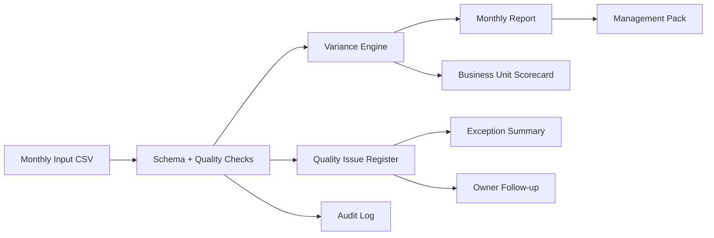

# Reporting Automation Workflow

[](https://github.com/HuseinHaji/reporting-automation-workflow/actions/workflows/ci.yml)

End-to-end reporting automation project that validates recurring business inputs, calculates plan-versus-actual performance, separates data-quality issues, and creates a controlled reporting pack.

## Business Goal

Monthly reporting often fails because manual spreadsheets mix calculations, ownership gaps, and quality issues in one place. This workflow separates those concerns into a repeatable control process: validate, calculate, route issues, and publish clean reporting outputs.

## Architecture



## Repository Structure

```text
.
├── data/
│   └── monthly_input.csv
├── output/
│   ├── business_unit_scorecard.csv
│   ├── control_summary.csv
│   ├── audit_log.csv
│   ├── exception_summary.csv
│   ├── monthly_report.csv
│   └── quality_issues.csv
└── src/
    └── run_report.py
```

## What The Pipeline Does

- Validates required reporting fields and flags missing owners, zero actuals, and zero plans.
- Calculates variance in euros and percentage against plan.
- Adds status and action fields so review items can be routed.
- Builds a business-unit scorecard for management review.
- Creates a control summary showing row count, variance, issue count, and report readiness.
- Writes an audit log for extract, validate, transform, and publish steps.
- Summarizes exceptions by business unit and severity.

## Outputs

| File | Purpose |
| --- | --- |
| `output/monthly_report.csv` | Clean report rows with variance, status, and action fields. |
| `output/quality_issues.csv` | Issue register with severity and business-unit context. |
| `output/business_unit_scorecard.csv` | Aggregated plan-versus-actual performance by unit. |
| `output/control_summary.csv` | One-row control dashboard for report readiness. |
| `output/exception_summary.csv` | Exception counts by business unit and severity. |
| `output/audit_log.csv` | Run-level audit trail for control evidence. |

## Run Locally

```bash
python3 src/run_report.py
```

No third-party packages are required; the project uses the Python standard library.

## Test

```bash
python3 -m pip install -r requirements-dev.txt
python3 -m pytest
```

## Simulated Business Impact

- Turns a manual close/reporting process into a controlled run with audit evidence.
- Separates clean reporting rows from exceptions before stakeholder delivery.
- Gives managers both variance visibility and issue ownership.

## How To Extend

- Add email or Slack routing for high-severity quality issues.
- Store run history in SQLite/PostgreSQL for trend monitoring.
- Add approval status fields for close-management workflows.
- Connect the scorecard output to a BI dashboard.

## Skills Demonstrated

Reporting automation, data-quality controls, auditability, variance analysis, workflow design, exception handling, and management-ready output design.
